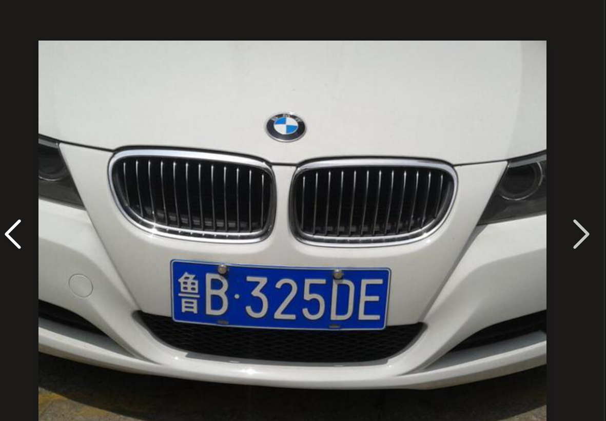
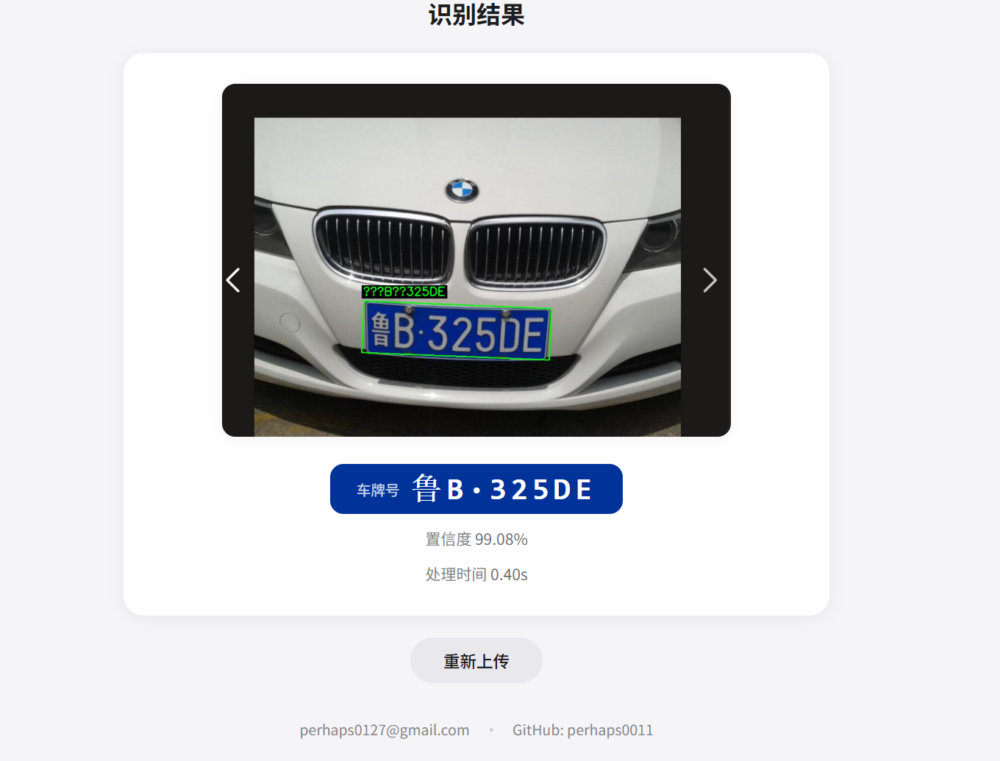

# Python 程序设计课程项目报告

## 基于 OpenCV 与 PaddleOCR 的车牌识别系统

**作 者**：李远征  
**学 校**：陕西科技大学  
**课 程**：Python 程序设计

---

### 一、项目背景

本项目的初衷不是做一个"完美"的车牌识别系统，而是希望通过一个具体的应用，把 Python 后端开发、图像处理、Web 前端、服务器部署这一整条链路串起来，在 AI 辅助下跑通全流程，对每个环节建立基本的认识。

**技术栈**：Python + OpenCV（图像处理）+ PaddleOCR（文字识别）+ FastAPI（Web 框架）+ 纯 HTML/CSS/JS（前端）



---

### 二、技术选型

在车牌检测环节考虑了三种方案：

| 方案 | 方法 | 为什么不选 |
|------|------|------------|
| YOLO 目标检测 | 训练/使用预训练模型定位车牌 | ❌ 服务器是 2 核 1G 轻量应用服务器，跑不动；也没有时间和数据训练模型 |
| PaddleX 文本检测 | 深度学习检测模型 | ❌ PaddlePaddle 3.3.1 存在 oneDNN 兼容性 bug，无法正常推理 |
| **OpenCV 传统视觉** | 边缘检测 + HSV 颜色分析 | ✅ **最终采用**。纯 CPU 运行，不需要 GPU 和训练数据，对蓝牌这种特征明显的目标效果够用 |

**关于为什么只检测蓝牌**：中国车牌主要有蓝牌（燃油车）和绿牌（新能源车）两类。本项目仅针对蓝牌，因为蓝牌底色为纯蓝色，HSV 颜色空间下有明确的取值范围，适合用传统视觉方法做颜色验证；而新能源绿牌是渐变绿色，颜色范围不稳定，且字符位数为 8 位、宽高比不同，需要额外的处理分支。作为课程项目，先聚焦覆盖最广的蓝牌是合理的选择。

**结论**：在轻量服务器的硬件约束下，传统图像处理是性价比最高的方案。可能没有 YOLO 那么"全能"，但对固定颜色和宽高比的中国蓝牌已经足够实用。

---

### 三、项目结构

```
vision/
├── run.py                  # 入口：CLI 模式 or Web 服务
├── app/
│   ├── config.py           # 所有可调参数集中管理
│   ├── detector.py         # 车牌检测（OpenCV 三策略）
│   ├── recognizer.py       # 字符识别（PaddleOCR 单例封装）
│   └── main.py             # FastAPI 路由 + 图库管理
├── static/index.html       # 前端页面
├── processed/              # 识别结果图片 + gallery.json
└── requirements.txt
```

几个工程实践：
- **入口统一**：`run.py` 用 argparse 同时支持 `python run.py`（Web）和 `python run.py predict 图片.jpg`（CLI）
- **配置集中**：检测阈值、HSV 范围、模型名等全部集中在 config.py，调优无需翻阅全部代码
- **模块解耦**：detector（图像处理）→ recognizer（OCR）→ main（Web 粘合），职责单一
- **JSON 持久化**：图库用 JSON 文件存储记录，零配置、零依赖

---

### 四、数据流动全流程

```
用户拖拽上传图片
    ↓
fetch POST /predict → FastAPI 接收文件
    ↓
cv2.imdecode 解码 → detect_plate() 三策略检测
    ├─ 策略1: Sobel X + Otsu 阈值（正常光照）
    ├─ 策略2: CLAHE + Canny（低光照/模糊）
    └─ 策略3: HSV 颜色掩码（边缘不清晰）
    ↓
透视变换校正（minAreaRect → getPerspectiveTransform）
    ↓
PaddleOCR PP-OCRv4 字符识别
    ↓
返回 JSON（plate_number / confidence / 图片URL）
    ↓
前端渲染结果 + 自动保存原图到图库
```



这趟流程串起了 Python 开发的核心场景：文件 I/O、第三方库调用、HTTP 通信、JSON 序列化、异步任务。

---

### 五、部署

| 环境 | 内容 |
|------|------|
| 服务器 | 阿里云轻量应用服务器（2 核 1G） |
| 域名 | [http://farvoy.top](http://farvoy.top) |
| 操作系统 | Alibaba Cloud Linux 3，Python 3.8 |
| Web 服务 | FastAPI + Uvicorn，宝塔面板 Nginx 反向代理 |

**部署中解决的 Python 相关问题**：
- pip 源上 paddlepaddle 版本滞后 → 用 `--no-deps` 绕过依赖检查，手动安装官网版
- OpenCV 缺 libGL.so.1 → `yum install mesa-libGL`
- Python 3.8 不支持 `list[dict]` 语法 → `from __future__ import annotations` 统一解决

---

### 六、AI 辅助开发

整个项目在 Claude（AI 助手）协助下完成，从零到部署上线约一天。AI 在以下环节提供了帮助：

- 技术选型分析，对比不同方案的优劣和可行性
- 项目骨架搭建，生成各模块代码框架
- 解释 OpenCV 参数含义，帮助理解每一行代码的作用
- 排查部署中的环境兼容性问题
- 前端 UI 实现（拖拽上传、标签切换、模态框）

**体会**：AI 最大的价值不是替你写代码，而是让你能"先动手，再理解"。遇到问题直接得到解答和代码示例，跑起来看到效果后再深入原理。这种从做中学的方式，适合课程项目在有限时间内了解全流程的目标。

---

### 七、总结

通过这个项目，我完整走了一遍 Python Web 应用从开发到上线的流程：后端 API 设计 → 算法模块集成 → 前端交互 → 服务器部署。虽然车牌识别本身不是新东西，但亲手把每个环节跑通、解决实际部署中遇到的问题，才是这门课最大的收获。

**项目地址**：[https://github.com/perhaps0011/vision](https://github.com/perhaps0011/vision)

**在线体验**：[http://farvoy.top](http://farvoy.top)
